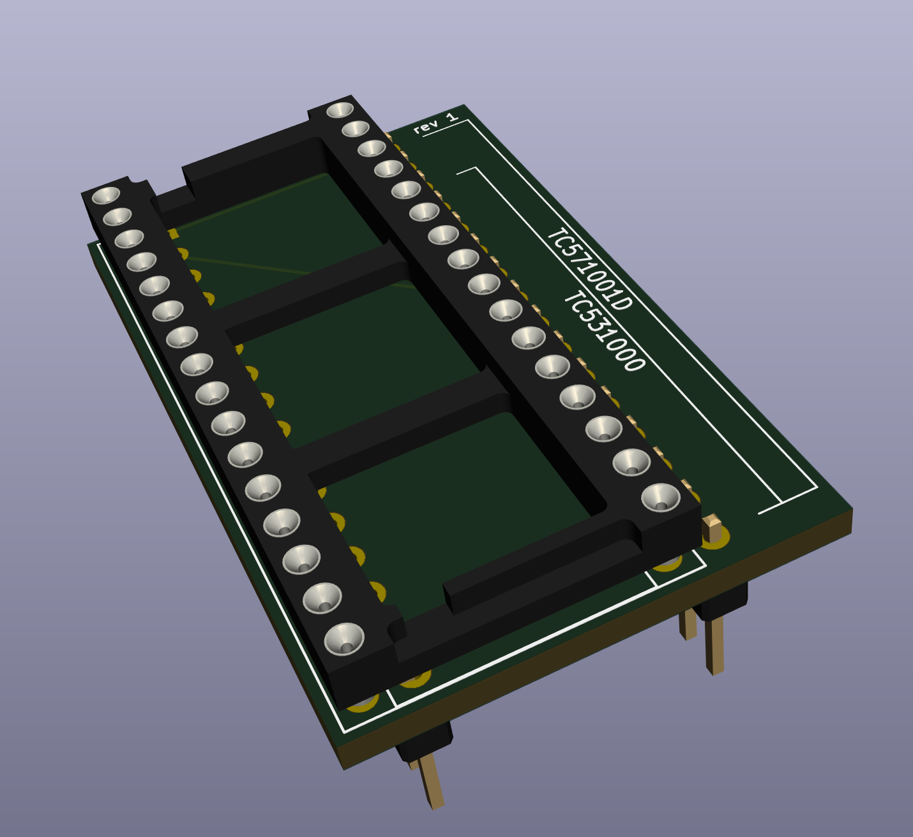

# TC571001D/TC531000 to 27C010 adapter

This little board should let you read a Toshiba TC571001D (32-pin EEPROM) or TC531000 (28-pin mask ROM) as if it is a 27C010 EPROM.

The programming pins are deliberately not connected up, so you can't write. I suppose maybe you could connect them, but Vpp would have to match and I didn't want to open that can of worms.

It should be possible to read the ROMs from an Apple IIGS with this.

I HAVE NOT TESTED THIS YET. Use at your own risk.

## Render

